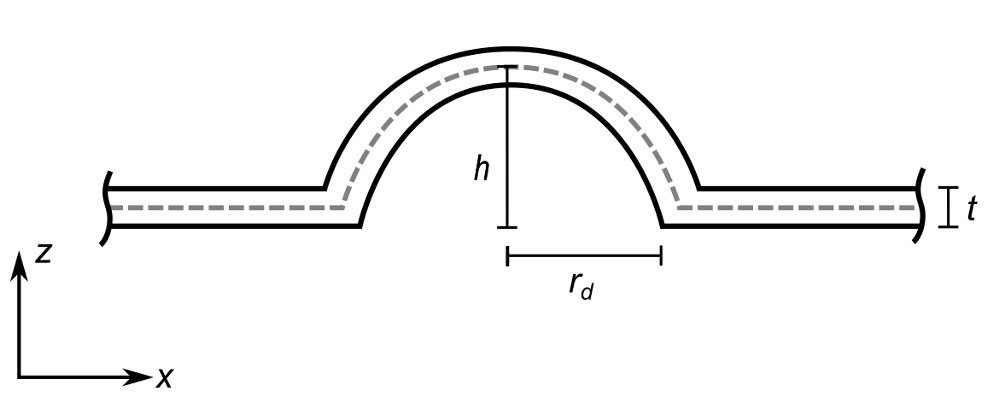
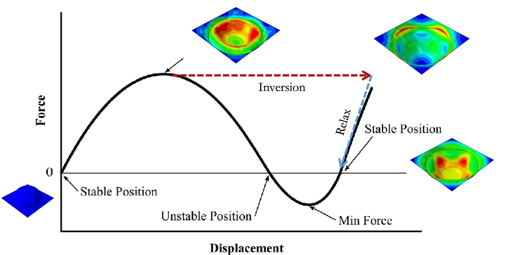
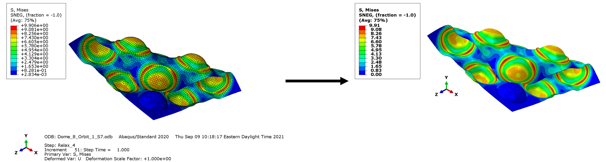

# ABAQUS Python codes - PSL Lab

## Dome Geometry Code
Creates the domain, steps, Boundary conditions and .INP file of a single dome. The code can be modified to change dome height (H), thickness (t), and dome base (rd).

We create three different steps:
+ 1 inversion step 
+ 2 relax steps to get the final stable state after the load is inverted.

## Post Image ABAQUS

Change image quality, ajusts background color and remove mesh from ABAQUS Simulations

