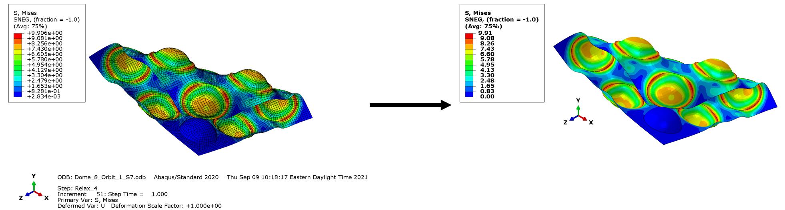
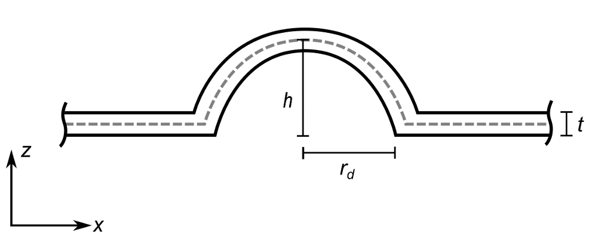
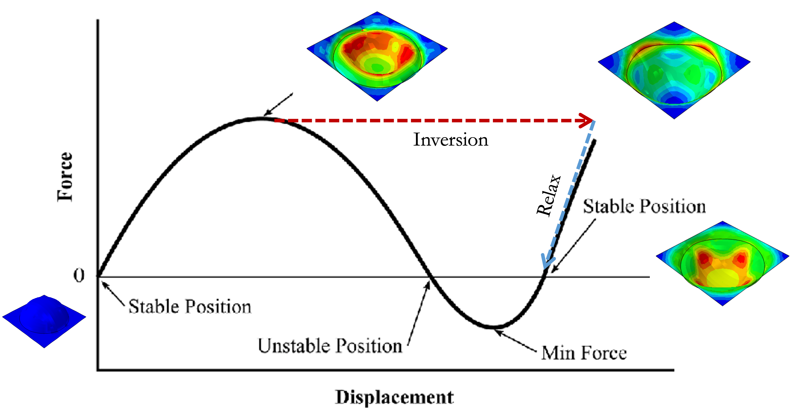
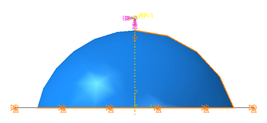
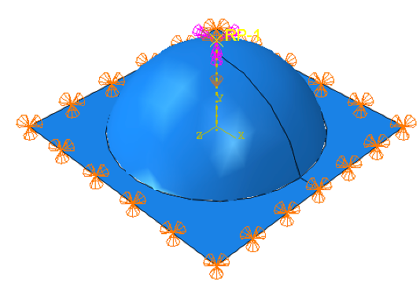

# ABAQUS Python Codes - PSL Lab
Programmable Structures Lab - Purdue University

---

## Overview

This repository contains ABAQUS/Python scripts to model, simulate, and post-process **bistable dome structures** - thin-shell domes that snap between two stable geometric configurations under applied load. The workflow covers geometry creation, FEM model setup, HPC cluster submission, and results visualization.



---

## Dome Geometry and Parameters

Each dome is defined by three geometric parameters:

| Parameter | Symbol | Default | Description |
|-----------|--------|---------|-------------|
| Height | `H` | 6.0 mm | Dome apex height above the flat base |
| Base radius | `rd` (= `base/2`) | 8.0 mm | Radius of the dome base circle |
| Thickness | `t` (= `th`) | 0.6 mm | Shell wall thickness |

The dome is embedded in a square unit cell of side `Unit_Cell`, which represents the repeating tile in an array. The dome profile is a circular arc computed from H and the base radius.



---

## Bistable Behavior

The dome exhibits snap-through bistability: it has two stable equilibrium positions (upward and inverted). Applying a downward displacement at the apex drives the structure through an unstable regime until it snaps to the inverted configuration. Releasing the load lets it settle into the second stable position.

The simulation captures this with three sequential steps:

1. **Inversion** - a downward load or velocity drives the dome past snap-through
2. **Relax 1** - load is removed; the dome finds its new equilibrium
3. **Relax 2** - additional relaxation to confirm the stable inverted state



---

## File Descriptions

### `Dome_Geometry.py` - Implicit Dynamics (Quasi-Static) Model

Full FEM model using **Implicit Dynamics** (quasi-static application) to drive snap-through via a **velocity boundary condition** at the dome apex reference point (RP-1).

**Key settings:**
- Solver: `ImplicitDynamicsStep`, `application=QUASI_STATIC`
- Inversion BC: constant downward velocity `v2 = -vel_factor * H / inv_time` applied to apex RP
- Damping: Rayleigh beta damping (`damp = 1e-8`) included to stabilize snap-through
- Unit cell: `Unit_Cell = 20.0 mm`
- Integration points: 11 (Gauss through thickness)
- Relaxation steps: defined but commented out - uncomment to run post-inversion settling

**Boundary conditions:**
- All 8 edges of the unit cell base: fully fixed (U1=U2=U3=0)
- Apex RP coupled (distributing) to the full dome surface; driven downward during inversion

**Outputs saved:**
- Field: S, EE, U, LE (every increment)
- History: ALLIE, ALLKE, ALLSE, ALLSD, ETOTAL (every increment)
- History at RP: U2, RF2 (tip displacement and reaction force - used to reconstruct the force-displacement curve)




---

### `Dome_Geometry_Arc.py` - Static Riks (Arc-Length) Model

Identical geometry and material as `Dome_Geometry.py`, but uses the **Static Riks** arc-length method to trace the full snap-through equilibrium path, including the unstable branch.

**Key differences from `Dome_Geometry.py`:**

| Property | `Dome_Geometry.py` | `Dome_Geometry_Arc.py` |
|----------|-------------------|----------------------|
| Solver | ImplicitDynamics (quasi-static) | StaticRiks |
| Inversion BC | Velocity (v2) | Displacement (u2 = -vel_factor * H) |
| Damping | Yes (beta = 1e-8) | No |
| Unit cell size | 20.0 mm | 22.0 mm |
| Relax steps | Defined (commented out) | Not included |
| Coupling rotations | ur1/ur2/ur3 = ON | ur1/ur2/ur3 = OFF |

**When to use which:**
- Use `Dome_Geometry_Arc.py` when you need the full equilibrium path including the unstable branch (peak force, minimum force, snap-through point)
- Use `Dome_Geometry.py` when you need to capture post-snap dynamics and relaxation to the second stable state

---

### `Post_Image_ABAQUS.py` - Visualization Post-Processing

Run inside ABAQUS/CAE to standardize the appearance of result plots. Applies consistent settings across all ODB files.

**What it does:**
- Sets contour plot to deformed shape with continuous color fill (`CONTOURS_ON_DEF`, `contourStyle=CONTINUOUS`)
- Removes mesh overlay (shows feature edges only)
- Applies perceptually uniform colormaps: `viridis`, `plasma`, `inferno`, `magma`, `cividis` (and reversed variants)
- Sets white background
- Configures legend font (Verdana bold, size 12), triad position and size
- Removes title, state, and compass annotations
- Sets isometric view

**Usage:** Run as a script from ABAQUS/CAE with an ODB open:
```
File > Run Script > Post_Image_ABAQUS.py
```

To change the colormap, edit the `colormap` variable at the top of the file.

---

### `Dome_Array_Cluster.sh` - Basic SLURM Array Job

Minimal SLURM batch script to submit multiple ABAQUS simulations in parallel on a cluster (Bell/Negishi at Purdue, account `aarrieta`).

**What it does:**
- Launches cases `1` through `9` simultaneously using a SLURM job array (`--array 1-9%9`)
- Each array task runs `Dome_Geometry_${n}.inp` as an independent ABAQUS job
- Uses 10 CPUs per task, 3-hour time limit
- Sends email notification on job END or FAIL

**Prerequisites:** INP files must be named `Dome_Geometry_1.inp` through `Dome_Geometry_9.inp` and present in the submission directory.

**To modify the parameter range:** change `--array 1-9%9` (format: `first-last%max_concurrent`).

---

### `Dome_Array_Cluster_folders.sh` - SLURM Array Job with File Management

Extended version of `Dome_Array_Cluster.sh` that adds organized output directory structure and separates successful from failed runs.

**Directory structure created:**

```
.
+-- inp_files/          Input files from all runs
+-- out_files/          SLURM .out files
+-- msg_files/          .msg files from successful runs
+-- sta_files/          .sta files from successful runs
+-- dat_files/          .dat files from successful runs
+-- results/            .odb result files from successful runs
+-- fail_simulations/   All files from failed runs
```

**Workflow per array task:**
1. Creates a temporary working directory `Case_${n}/`
2. Copies `Dome_Geometry_${n}.inp` from `common/` subdirectory
3. Runs ABAQUS interactively in the working directory
4. Checks `.sta` file for `SUCCESSFULLY` to determine pass/fail
5. Copies outputs to the appropriate folders
6. Removes the temporary working directory

**Use this script** (instead of the basic one) when running large parameter sweeps where you need to keep successful ODB files separate from failed runs and clean up scratch space automatically.

---

## Workflow Summary

```
1. Set dome parameters (H, th, base, Unit_Cell) in geometry script
2. Run Dome_Geometry.py or Dome_Geometry_Arc.py inside ABAQUS/CAE
   -> Generates Dome_Geometry_N.inp
3. Copy INP files to cluster under common/
4. Submit with Dome_Array_Cluster_folders.sh (or basic version)
5. Retrieve .odb files from results/
6. Open ODB in ABAQUS/CAE, run Post_Image_ABAQUS.py for consistent plots
```

---

## Material Properties (Default)

| Property | Value | Units |
|----------|-------|-------|
| Elastic modulus | 12.0 | MPa |
| Poisson ratio | 0.35 | - |
| Density | 1.22e-9 | ton/mm^3 |
| Beta damping | 1e-8 | - (Dome_Geometry.py only) |

Material represents a soft elastomer (e.g., silicone rubber).
